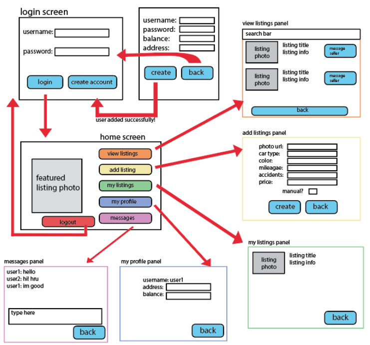

# MotorMarket: an Online Car Shop

## User Guide

## 1. 

To run the project, run Server.java to start the server. After starting the server, you can run Mainframe.java to launch the GUI system, which will put you right onto the login screen. You are also able to open multiple instances of Mainframe.java which allows for multiple users to connect to the server at once. To do this in IntelliJ, you will need to edit the configuration for your run process. To do this, go to Run > Edit Configurations > Modify Options (dropdown menu) and enable the "Allow Multiple Instances" option. As for the tests, you can just use the test runner specific to the IDE that you are on. Keep in mind, when running the tests, some GUI windows will open up, and for the ones that remain open, you either need to press "Ok" or "Cancel" to close the window and finish the test.

## 2. 

**Rohan Kannan** - Completed DatabaseTestCase class. Worked on general formatting and submitted project on Vocareum workspace. Worked on client and server classes, completed server class. Completed Chat and ChatPanel and implemented multi-client functionality. Wrote and formatted ChatPanelTestCase.

**Alistair Joseph** - Submitted Vocareum Workspace, Report, and Presentation. Worked on Database Interface and Database class. Formatted both classes too. Worked on Client and Server classes, completed Client class. Designed and implemented all GUI and functionality with the exception of Chat and ChatPanel

**Lydia Schmucker** - Completed User class, Listing class, and Interfaces for both those classes. Formatted both classes too. Completed the ClientTestCase class and formatting. Worked on the readme. Created the GUI system flowchart and wrote and formatted GUI panel interfaces.

**Stephen Tushentsov** - Completed DatabaseTestCase class and ListingTestCase class. Worked on repo structure, general formatting, and readme. Completed and formatted the ServerTestCase. Added client and server interfaces. Completed and formatted all test case files relating to GUI panels or frames along with NewClientTestCase. Worked on testing section/slide on project report & group presentation.

## 3. Class Descriptions

### `Database.java`
Class contains methods to read from and write to `Listings.txt` and `Users.txt`. Also defines static file path constants. Includes methods to update listings, users, and chat data. Implements `DatabaseInterface`. DatabaseTestCase.java tests functionality and methods of Database.java testing if it can read/write properly.

### `Listing.java`
Model for a car listing. Contains fields such as listing ID, seller username, photo URL, car type, color, mileage, accident count, price, and transmission type. Provides full getter/setter support, a constructor, and a `toString()` method for file persistence. Implements `ListingInterface`. ListingTestCase.java tests functionality and methods of Listing.java testing if getters, setters, and toString methods are properly formatted.

### `User.java`
Model for a system user. Fields include username, password, balance, pickup address, and associated listings. Includes balance update logic, listing management methods, and a `toString()` method. Implements `UserInterface`. UserTestCase.java tests functionality and methods of User.java testing if getters, setters, and toString methods are properly formatted.

### `Client.java`(Deprecated)
No longer used as of Phase 3. Previously handled command-line testing and client-server communication via socket. Replaced by `NewClient.java`.

### `Server.java`
Runs a multi-threaded socket server on port 4242. Handles commands from clients (`GET_LISTINGS`, `BUY_LISTING`, etc.), coordinates with the `Database` class to retrieve/update persistent data, and manages concurrent communication. ServerTestCase.java tests functionality and methods of Server.java testing if server can properly launch on a thread and if server can be stopped.

### `AddListingPanel.java`
Swing GUI panel for adding a new listing. Contains form fields for entering listing details (e.g. image URL, car info) and validation logic before submission. AddListingPanel.java tests functionality and methods of AddListingPanel.java testing if a listing can be properly added without any issues along with testing if the panel launches.

### `ListingsPanel.java`
Displays all available listings excluding the current user’s and sold items. Supports keyword search, dynamic card generation with image loading, and “Buy Now” or “Message Seller” buttons. ListingsPanelTestCase.java tests functionality and methods of ListingsPanel.java testing if all listings can be without any issues along with testing if the panel launches.

### `EditListingsPanel.java`
Displays the logged-in user’s listings, both sold and unsold. Allows editing of unsold listings' photo URL, color, car type, and price through an edit dialog. EditListingsPanelTestCase.java tests functionality and methods of EditListingsPanel.java testing if a listing can be properly edited without any issues along with testing if the panel launches.

### `HubPanel.java`
Main dashboard after login. Allows navigation to view/add/edit listings, view chats, access profile, or logout. Displays a random featured listing with image and caption. HubPanelTestCase.java tests functionality and methods of HubPanel.java testing if the HubPanel properly launches without any issues.

### `LoginPanel.java`
Login interface for users. Takes credentials and communicates with the server for authentication. LoginPanelTestCase.java tests functionality and methods of LoginPanel.java testing if a user can login without any issues along with testing if the panel launches.

### `RegistrationPanel.java`
User registration interface. Takes new user info and sends it to the server for account creation. Includes basic input validation. RegistrationPanelTestCase.java tests functionality and methods of RegistrationPanel.java testing if a user can create a new account without any issues along with testing if the panel launches.

### `MessagingPanel.java`
Displays a messaging UI where users can view and send messages. Pulls recent messages from server and enables real-time communication using timestamps. MessagingPanelTestCase.java tests functionality and methods of MessagingPanel.java testing if the chat messages pop up without any issues along with testing if the panel launches.

### `MainFrame.java`
Main application window and entry point for GUI. Manages all panel views, handles user state, client connection, and panel switching logic. MainFrameTestCase.java tests functionality and methods of MainFrame.java testing if a user can launch the GUI system after running the server without any issues.

### `NewClient.java`
Primary socket-based client class used in GUI. Replaces legacy `Client.java`. Provides `sendCommand(...)` method to interact with the server and receive typed responses. NewClientTestCase.java tests functionality and methods of NewClient.java testing if a client can properly connect to the server along with testing if multiple clients can work at once.

### `Chat.java`
Represents a single chat message, including sender, recipient, message content, and timestamp. Used for reading and writing chat data in files. ChatTestCase.java tests functionality and methods of Chat.java testing if getters, setters, and toString methods are properly formatted.

### `ChatPanel.java`
Dedicated panel for one-on-one chat with a seller. Opened from within a listing card. ChatPanelTestCase.java tests functionality and methods of ChatPanel.java testing if the chat panel is actually accurate to what the users are sending along with testing if the panel launches.

### `AncestorListenerAdapter.java`
Utility class that simplifies `AncestorListener` implementation by allowing selective override of methods. Used to trigger data reloads when a panel is shown.
